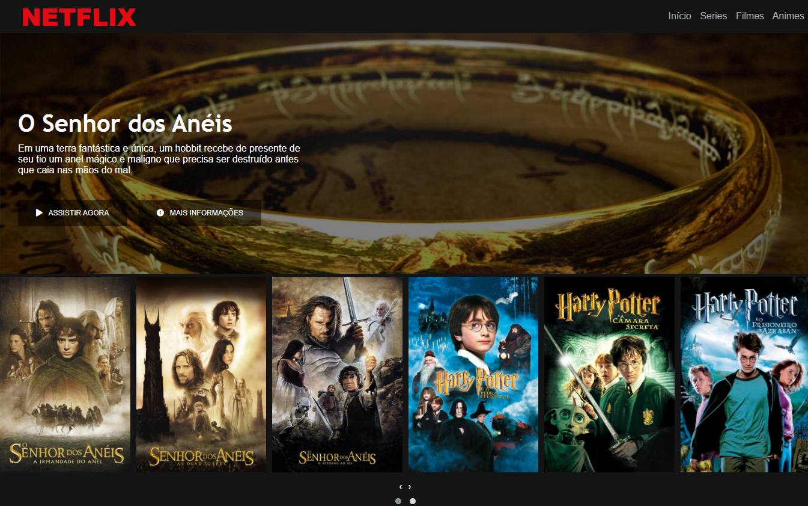

# Netflix

## Sobre o projeto.
Site responsivo da Netflix. Tema Bruxos e Magos. Site responsivo e com biblioteca do jQuery. Utilizei o carrossel do jQuery para colocar os filmes de forma semelhante a do site original.

Data de conclusão: 29/10/2021

## Ferramentas e tecnologias usadas nesse projeto.
 
```js    
function Netflix(Project) {
    if (Front End) {
        const Stack = `${HTML}, ${CSS}, ${JavaScript}`;
    } else (Framework) {
        const Stack = `${jQuery}`;
    }
};

``` 
<br>

<div align="center">



</div>

---

> - Autores: 
>   - [Eduardo Kayke](https://github.com/EduardoKayke "Perfil do Eduardo")

- [Voltar ao perfil do Github.](https://github.com/EduardoKayke "Perfil do Eduardo")

_Um dia seremos a tecnologia. Biohacking a própria evolução de nós mesmos._
